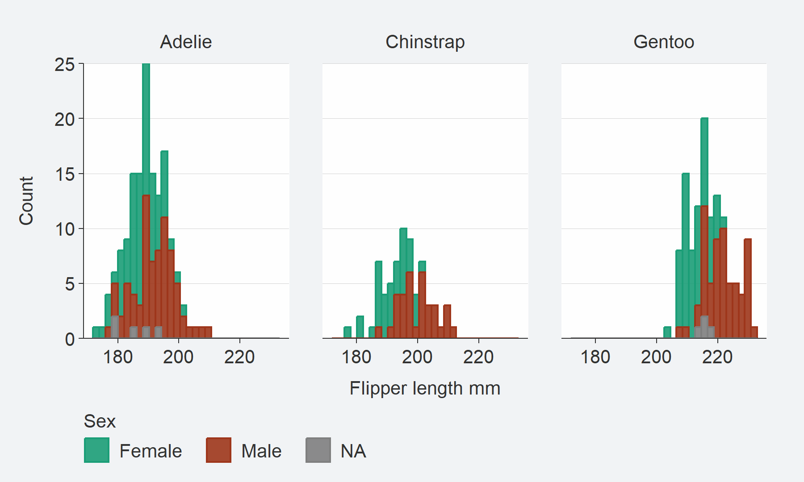
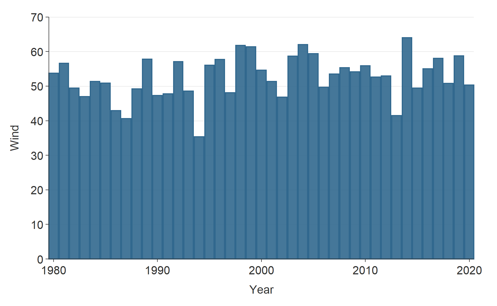
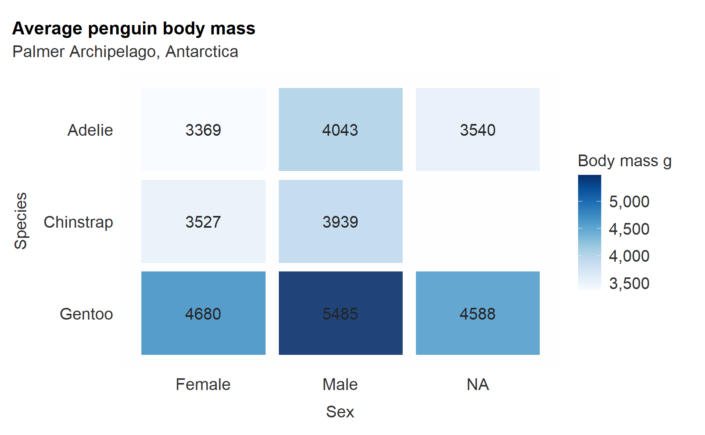
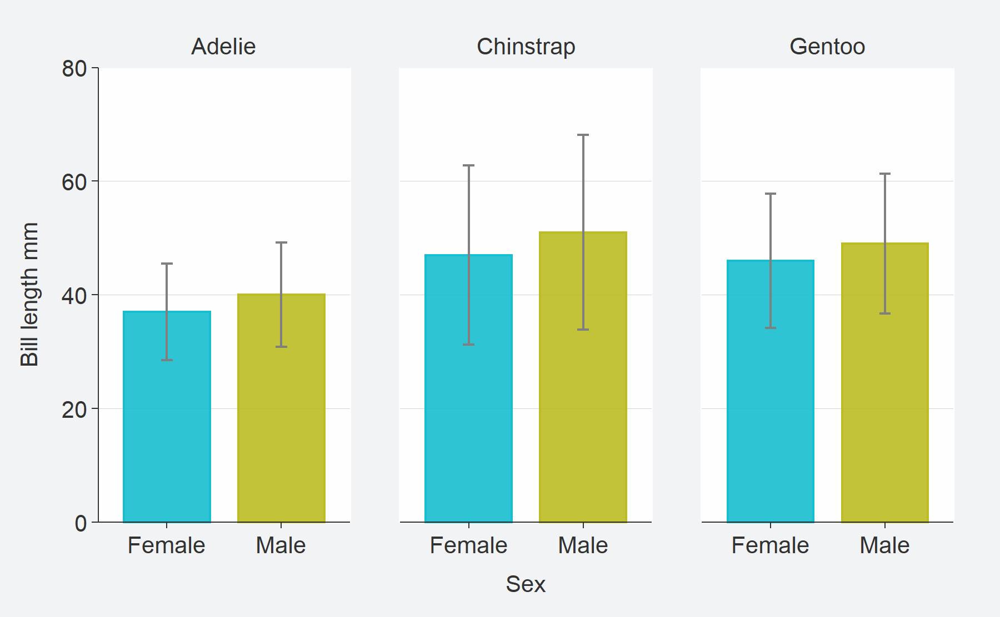

<!-- README.md is generated from README.Rmd. Please edit that file -->

# ggblanket 

<!-- badges: start -->

[](https://CRAN.R-project.org/package=ggblanket)
[](https://r-pkg.org/pkg/ggblanket)
[](https://r-pkg.org/pkg/ggblanket)
[](https://r-pkg.org/pkg/ggblanket)
[](https://r-pkg.org/pkg/ggblanket)
<!-- badges: end -->

## Overview

{ggblanket} is a package of wrapper functions around the amazing
{ggplot2} package.

The objective is to **simplify beautiful {ggplot2} visualisation**.

With this in mind, the {ggblanket} package:

-   uses quick functions that wrap around a single geom
-   merges col and fill aesthetics into a single col aesthetic
-   provides colour customisation via a pal argument
-   treats faceting as an aesthetic
-   pushes x and y limits to the max of x and y breaks with no expanding
    by default
-   arranges horizontal geom y and col labels etc to be in correct order
-   provides quick arguments for scale, title and legend adjustment
-   changes default colours, alphas, widths and themes
-   converts numeric labels to comma format by default
-   allows users to access all other non-aesthetic geom functionality

## Installation

Install either from CRAN with:

``` r
install.packages("ggblanket")
```

Or install the development version with:

``` r
# install.packages("devtools")
devtools::install_github("davidhodge931/ggblanket")
```

## Website

Click [here](https://davidhodge931.github.io/ggblanket/) for the
{ggblanket} website.

## Examples

``` r
library(dplyr)
library(ggplot2)
library(ggblanket)
library(snakecase)
library(palmerpenguins)
```

``` r
iris %>%
  ggplot() +
  geom_point(aes(x = Sepal.Width, y = Sepal.Length, col = Species))
```

<!-- -->

``` r
iris %>%
  gg_point(x = Sepal.Width, y = Sepal.Length, col = Species)
```

<!-- -->

``` r
penguins %>% 
  ggplot() +
  geom_histogram(aes(x = body_mass_g)) 
```

<!-- -->

``` r
penguins %>% 
  gg_histogram(x = body_mass_g) 
```

<!-- -->

``` r
penguins %>%
  tidyr::drop_na() %>%
  group_by(species, sex, island) %>%
  summarise(body_mass_kg = mean(body_mass_g) / 1000) %>%
  ggplot() +
  geom_col(aes(x = body_mass_kg, y = forcats::fct_rev(species), fill = sex),
           position = "dodge", width = 0.75) +
  facet_wrap(~ island) +
  theme(legend.position = "bottom") +
  scale_fill_manual(name = "Sex", 
                    values = rev(scales::hue_pal()(2)), 
                    labels = ~ to_sentence_case(.x)) +
  labs(x = "Body mass kg", y = "Species") 
```

<!-- -->

``` r
penguins %>%
  tidyr::drop_na() %>% 
  group_by(species, sex, island) %>%
  summarise(body_mass_kg = mean(body_mass_g) / 1000) %>%
  gg_col(
    x = body_mass_kg,
    y = species,
    col = sex,
    facet = island,
    position = "dodge",
    col_legend_place = "b",
    titles = ~to_sentence_case(.x),
    col_labels = ~to_sentence_case(.x)
  )
```

<!-- -->

Other examples

``` r
storms %>% 
  group_by(year) %>% 
  summarise(wind = mean(wind, na.rm = TRUE)) %>% 
  gg_line(x = year, 
          y = wind, 
          x_labels = ~.x,
          y_zero = TRUE,
          titles = ~ to_sentence_case(.x),
          title = "Storm wind speed",
          subtitle = "USA average storm wind speed, 1975\u20132020", 
          y_title = "Wind speed (knots)", 
          caption = "Source: NOAA",
          theme = gg_theme(y_grid = TRUE)) +
  geom_point()
```

<!-- -->

``` r
penguins %>% 
  tidyr::drop_na() %>% 
  mutate(body_mass_kg = body_mass_g / 1000) %>%
  gg_density(
    x = body_mass_kg, 
    col = species, 
    facet = sex, 
    titles = ~ to_sentence_case(.x),
    facet_labels = ~ to_sentence_case(.x),
    col_legend_place = "b")
```

<!-- -->

``` r
penguins %>%
  gg_jitter(
    x = species,
    y = body_mass_g,
    col = flipper_length_mm,
    col_intervals = ~ santoku::chop_quantiles(.x, probs = seq(0, 1, 0.25)),
    position = position_jitter(width = 0.2, height = 0, seed = 123), 
    y_zero = TRUE,
    titles = ~ to_sentence_case(.x)
    )
```

<!-- -->

``` r
penguins %>% 
  gg_smooth(
    x = bill_length_mm,
    y = flipper_length_mm,
    col = species,
    titles = ~ to_sentence_case(.x)
    ) 
```

<!-- -->

``` r
penguins %>%
  gg_histogram(
    x = body_mass_g,
    col = species, 
    facet = sex, 
    col_legend_place = "b", 
    pal = pals::brewer.dark2(3),
    titles = ~ to_sentence_case(.x),
    facet_labels = ~ to_sentence_case(.x), 
    x_labels = ~ .x / 1000, 
    x_title = "Body mass kg")
```

<!-- -->

``` r
df <- data.frame(
  trt = factor(c(1, 1, 2, 2)),
  resp = c(1, 5, 3, 4),
  group = factor(c(1, 2, 1, 2)),
  upper = c(1.1, 5.3, 3.3, 4.2),
  lower = c(0.8, 4.6, 2.4, 3.6)
)

dodger <- position_dodge(width = 0.75)

gg_blank(df, x = resp, xmin = lower, xmax = upper, y = trt, col = group) +
  geom_col(position = dodger, width = 0.75, alpha = 0.9) +
  geom_errorbar(position = dodger, width = 0.2, col = "#232323")
```

<!-- -->

``` r
iris %>% 
  add_tooltip_text(rename_with = snakecase::to_sentence_case) %>% 
  gg_point(x = Sepal.Width, 
           y = Sepal.Length, 
           col = Species, 
           text = text, 
           theme = gg_theme("helvetica", x_grid = TRUE, y_grid = TRUE)) %>% 
  plotly::ggplotly(tooltip = "text")
```


