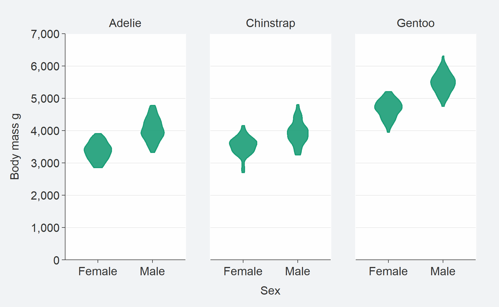
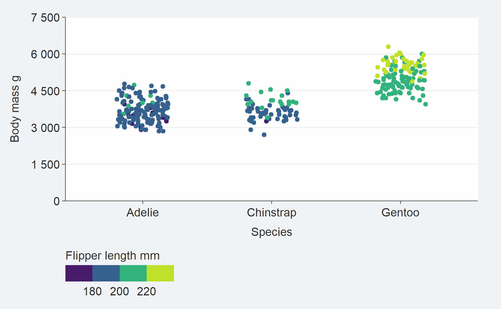
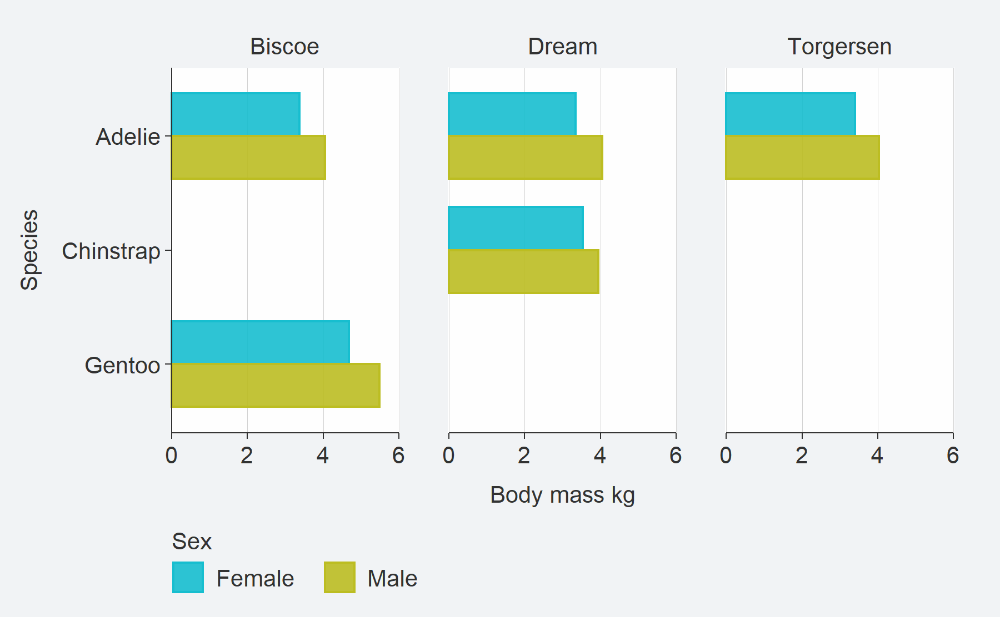

<!-- README.md is generated from README.Rmd. Please edit that file -->

# ggblanket 

<!-- badges: start -->

[](https://CRAN.R-project.org/package=ggblanket)
[](https://r-pkg.org/pkg/ggblanket)
[](https://r-pkg.org/pkg/ggblanket)
[](https://r-pkg.org/pkg/ggblanket)
[](https://r-pkg.org/pkg/ggblanket)
<!-- badges: end -->

## Overview

{ggblanket} is a package of wrapper functions around the amazing
{ggplot2} package.

The primary objective of the package is to **make beautiful {ggplot2}
visualisation simpler**.

With this objective in mind, the ggblanket package:

-   uses quick functions that wrap around a single geom
-   merges col and fill aesthetics into a single col aesthetic
-   provides colour customisation via a pal argument
-   treats faceting as an aesthetic
-   pushes x and y limits to the max of the x and y breaks by default
-   arranges horizontal geom y and col labels etc to be in correct order
-   converts titles and labels to sentence case and comma format by
    default
-   provides arguments for scale adjustment and legend placement
-   allows users to access all other non-aesthetic geom functionality
-   changes default colours, alphas, widths and themes

## Installation

Install either from CRAN with:

``` r
install.packages("ggblanket")
```

Or install the development version with:

``` r
# install.packages("devtools")
devtools::install_github("davidhodge931/ggblanket")
```

## Examples

``` r
library(dplyr)
library(ggplot2)
library(ggblanket)
library(palmerpenguins)

penguins <- penguins %>% 
  tidyr::drop_na() %>% 
  mutate(body_mass_kg = body_mass_g / 1000) 
```

``` r
penguins %>% 
  ggplot() +
  geom_histogram(aes(x = body_mass_kg)) 
```

<!-- -->

``` r
penguins %>% 
  gg_histogram(x = body_mass_kg) 
```

<!-- -->

``` r
penguins %>%
  group_by(species, sex, island) %>%
  summarise(body_mass_kg = mean(body_mass_kg)) %>%
  ggplot() +
  geom_col(
    aes(x = body_mass_kg, y = species, fill = sex), 
    position = "dodge"
    ) +
  facet_wrap( ~ island) +
  theme(legend.position = "bottom")
```

<!-- -->

``` r
penguins %>%
  group_by(species, sex, island) %>%
  summarise(body_mass_kg = mean(body_mass_kg)) %>%
  gg_col(
    x = body_mass_kg,
    y = species,
    col = sex,
    facet = island,
    position = "dodge",
    col_legend_place = "b"
  )
```

<!-- -->

Other nice graphs

``` r
penguins %>%
  gg_histogram(
    x = body_mass_kg,
    col = species, 
    facet = sex, 
    col_legend_place = "b", 
    pal = pals::brewer.dark2(3))
```

<!-- -->

``` r
storms %>% 
  group_by(year) %>% 
  summarise(wind = mean(wind, na.rm = TRUE)) %>% 
  gg_line(x = year, 
          y = wind, 
          y_zero = TRUE,
          x_labels = ~.x, 
          title = "USA average storm wind speed, 1975-2020",
          subtitle = "Storms are stormy", 
          y_title = "Wind speed (knots)", 
          theme = gg_theme(y_grid = TRUE)) +
  geom_point()
```

<!-- -->

``` r
penguins %>% 
  gg_density(
    y = body_mass_kg, 
    col = sex, 
    facet = species)
```

<!-- -->

``` r
penguins %>% 
  gg_boxplot(
    x = sex,
    y = body_mass_g, 
    col = species, 
    facet = species)
```

<!-- -->

``` r
penguins %>%
  gg_jitter(
    x = species,
    y = body_mass_g,
    col = flipper_length_mm,
    col_intervals = ~santoku::chop_quantiles(.x, probs = seq(0, 1, 0.25)),
    position = position_jitter(width = 0.2, height = 0, seed = 123), 
    y_zero = TRUE)
```

<!-- -->

``` r
df <- data.frame(
  trt = factor(c(1, 1, 2, 2)),
  resp = c(1, 5, 3, 4),
  group = factor(c(1, 2, 1, 2)),
  upper = c(1.1, 5.3, 3.3, 4.2),
  lower = c(0.8, 4.6, 2.4, 3.6)
)

dodger <- position_dodge(width = 0.75)

gg_blank(df, x = trt, y = resp, ymin = lower, ymax = upper, col = group) +
  geom_col(position = dodger, width = 0.75) +
  geom_errorbar(position = dodger, width = 0.2, col = "#232323")
```

<!-- -->
