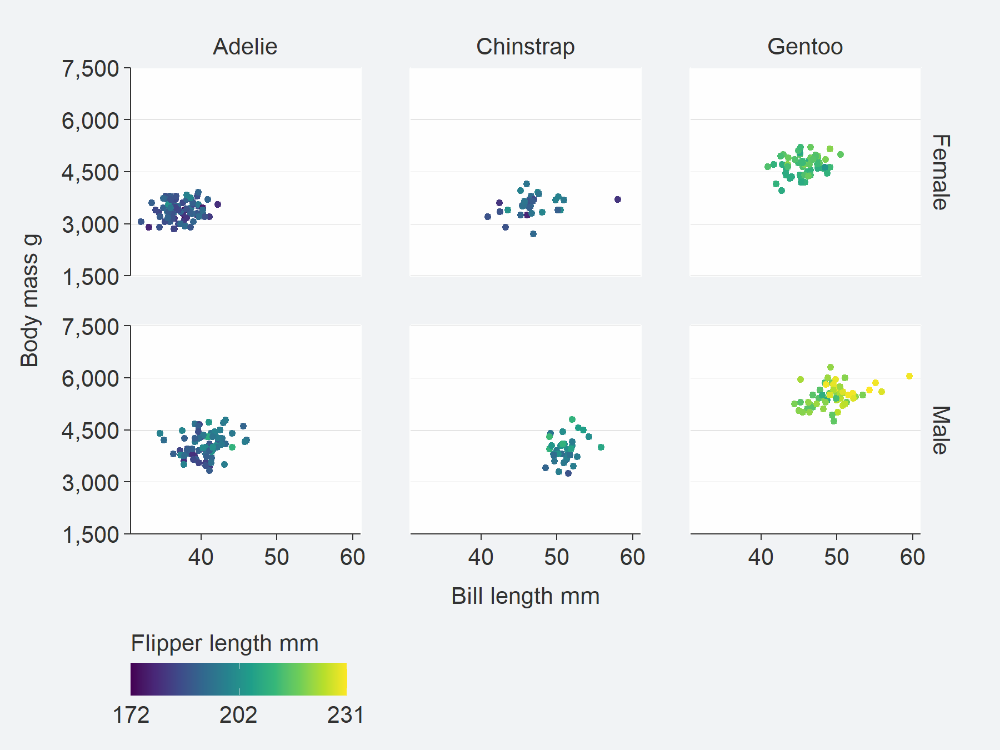

<!-- README.md is generated from README.Rmd. Please edit that file -->

# ggblanket 

<!-- badges: start -->

[](https://CRAN.R-project.org/package=ggblanket)
[](https://r-pkg.org/pkg/ggblanket)
[](https://r-pkg.org/pkg/ggblanket)
[](https://r-pkg.org/pkg/ggblanket)
[](https://r-pkg.org/pkg/ggblanket)
<!-- badges: end -->

## Overview

{ggblanket} is a package of wrapper functions around the amazing
{ggplot2} package.

The objective is to **simplify beautiful {ggplot2} visualisation**.

With this in mind, the {ggblanket} package:

1.  uses quick functions that wrap around a single geom
2.  merges col and fill aesthetics into a single col aesthetic
3.  provides colour customisation via pal and alpha arguments
4.  treats faceting as an aesthetic
5.  provides prefixed arguments for scale, title and legend adjustment
6.  For numeric or dates, changes default limits to the min/max of x and
    y breaks with zero expanding
7.  arranges horizontal geom y and col labels etc to be in correct order
8.  changes default colours, alphas, widths, themes, and numeric label
    format
9.  provides access to all of the relevant geom arg’s through the dots
    argument
10. supports ggplotly use.

## Installation

Install either from CRAN with:

``` r
install.packages("ggblanket")
```

Or install the development version with:

``` r
# install.packages("devtools")
devtools::install_github("davidhodge931/ggblanket")
```

## Website

Click [here](https://davidhodge931.github.io/ggblanket/) for the
{ggblanket} website.

## Examples

``` r
library(dplyr)
library(ggplot2)
library(ggblanket)
library(snakecase)
library(palmerpenguins)
```

1.  uses quick functions that wrap around a single geom

``` r
iris %>%
  gg_point(x = Sepal.Width, y = Sepal.Length, col = Species)
```

<!-- -->

2.  merges col and fill aesthetics into a single col aesthetic

``` r
penguins %>% 
  gg_histogram(x = body_mass_g, col = species) 
```

<!-- -->

3.  provides colour customisation via pal and alpha arguments

``` r
penguins %>% 
  gg_density(x = body_mass_g, col = species, 
             pal = pals::brewer.dark2(3), 
             alpha = 0.5)
```

<!-- -->

4.  treats faceting as an aesthetic

``` r
penguins %>% 
  tidyr::drop_na() %>% 
  gg_violin(x = sex, y = body_mass_g, facet = species)
```

<!-- -->

5.  provides prefixed arguments for scale, title and legend adjustment

``` r
penguins %>%
  gg_jitter(
    x = species,
    y = body_mass_g,
    col = flipper_length_mm,
    position = position_jitter(width = 0.2, height = 0, seed = 123), 
    col_intervals = ~ santoku::chop_quantiles(.x, probs = seq(0, 1, 0.25)),
    col_legend_place = "b",
    y_zero = TRUE,
    y_breaks_width = 1500,
    titles = to_sentence_case
    )
```

<!-- -->

6.  For numeric or dates, changes default limits to the min/max of x and
    y breaks with zero expanding

This often looks visually very nice. However, it is simple to adjust to
the {ggplot2} default by applying `*_limits = c(NA, NA)` or
`c(lubridate::NA_Date_, lubridate::NA_Date_)` in combination with
`*_expand = c(0.05, 0.05)`.

You can also change the default theme gridlines to make this look more
balanced.

``` r
storms %>% 
  group_by(year) %>% 
  summarise(wind = mean(wind, na.rm = TRUE)) %>%
  gg_line(x = year, 
          y = wind, 
          x_labels = ~.x,
          x_expand = c(0.05, 0.05),
          x_limits = c(NA, NA),
          y_zero = TRUE,
          title = "Storm wind speed",
          subtitle = "USA average storm wind speed, 1975\u20132020", 
          x_title = "Year",
          y_title = "Wind speed (knots)", 
          caption = "Source: NOAA",
          theme = gg_theme(y_grid = TRUE)) +
  geom_point()
```

<!-- -->

7.  arranges horizontal geom y and col labels etc to be in correct order

``` r
penguins %>%
  tidyr::drop_na() %>% 
  group_by(species, sex, island) %>%
  summarise(body_mass_kg = mean(body_mass_g) / 1000) %>%
  gg_col(x = body_mass_kg, y = species, col = sex, facet = island,
    position = "dodge", 
    col_legend_place = "b", 
    titles = to_sentence_case, 
    col_labels = to_sentence_case)
```

<!-- -->

8.  changes default colours, alphas, widths and themes

``` r
penguins %>%
  group_by(species, sex) %>%
  summarise(across(body_mass_g, ~ round(mean(.x, na.rm = TRUE)), 0)) %>% 
  gg_tile(sex, species, col = body_mass_g, 
          titles = to_sentence_case,
          x_labels = to_sentence_case,
          pal = pals::brewer.blues(9),
          width = 0.9, 
          height = 0.9, 
          title = "Average penguin body mass",
          subtitle = "Palmer Archipelago, Antarctica",
          theme = gg_theme(pal_axis = "#ffffff", pal_ticks = "#ffffff")) +
  geom_text(aes(label = body_mass_g), size = 3.5, col = "#232323") 
```

<!-- -->

9.  provides access to all of the relevant geom arg’s through the dots
    argument

``` r
penguins %>%
  tidyr::drop_na() %>% 
  gg_smooth(
    x = bill_length_mm,
    y = flipper_length_mm,
    col = species,
    titles = to_sentence_case,
    level = 0.99
    ) 
```

<!-- -->

10. supports ggplotly use

`ggplotly` won’t work in all situations. But it does work a lot of the
time.

``` r
iris %>% 
  add_tooltip_text(rename_with = to_sentence_case) %>% 
  gg_point(x = Sepal.Width, 
           y = Sepal.Length, 
           col = Species, 
           text = text, 
           titles = to_sentence_case,
           theme = gg_theme("helvetica", x_grid = TRUE, y_grid = TRUE)) %>% 
  plotly::ggplotly(tooltip = "text")
```


